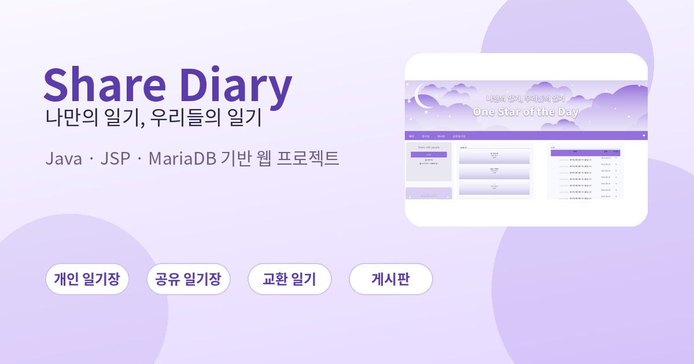
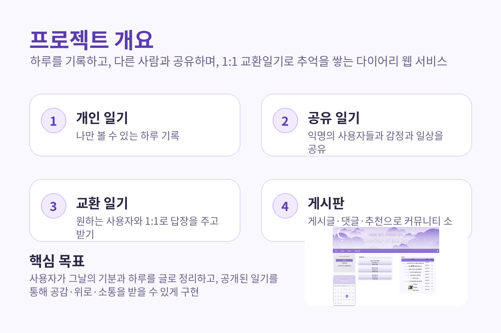
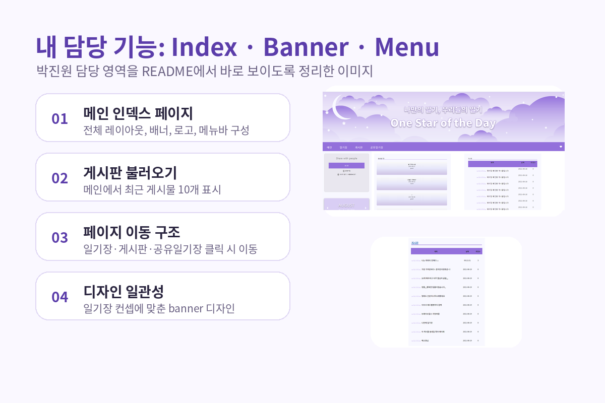
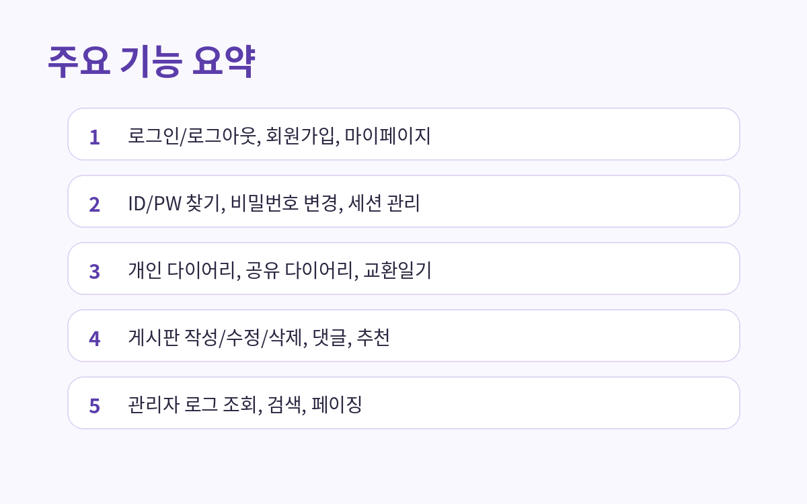
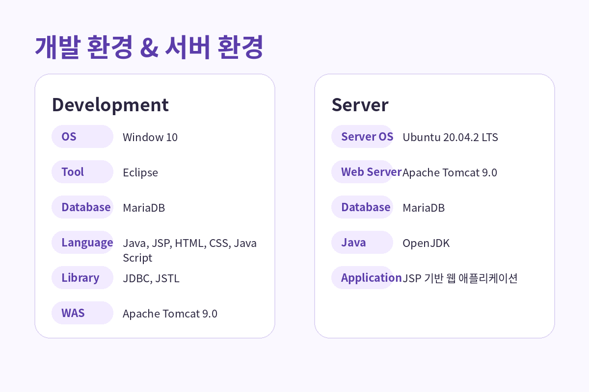
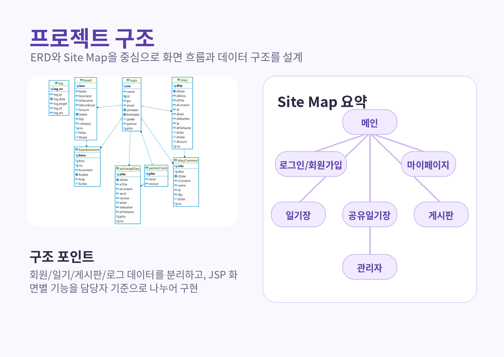
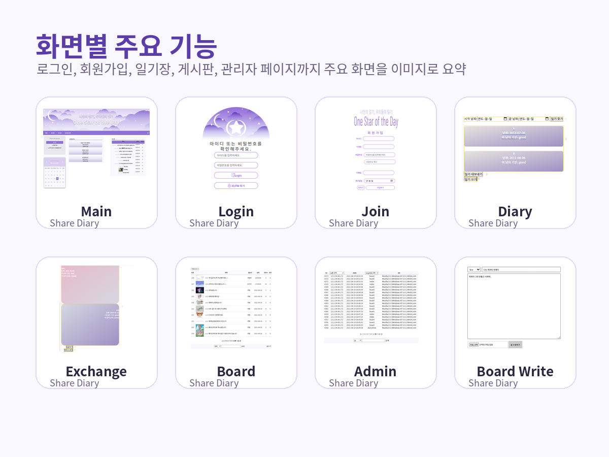

# Share Diary

> 나만의 일기, 우리들의 일기
> JSP 기반 일기장 공유 웹 프로젝트

---

## 📌 프로젝트 소개

**Share Diary**는 사용자가 하루를 일기로 기록하고, 공개된 일기를 통해 다른 사용자와 공감·소통할 수 있도록 기획한 **일기장 웹 프로젝트**입니다.

사용자는 개인 일기장을 통해 자신의 하루를 기록할 수 있고, 공유 일기장을 통해 익명의 사용자들과 일상을 나눌 수 있습니다. 또한 교환 일기 기능을 통해 특정 사용자와 1:1로 일기를 주고받으며 추억을 기록할 수 있습니다.

---

## 🗓 프로젝트 기간

* **2021.07 ~ 2021.08**

---

## 👥 팀 구성

* **팀명** : A조 - 쉐다팀
* **팀원** : 선태영, 김샛별, 신청훈, 박진원, 백소영, 남소영
* **훈련과정명** : 디지털 데이터 융합 JAVA 응용 SW 개발자 전문과정

---

## 🙋 담당 역할

### 박진원

* 메인 인덱스 페이지 레이아웃 구성
* 메인 페이지 `index CSS` 작업
* 메인 화면에 게시판 최신 글 불러오기
* 전체 페이지 공통 요소인 `banner`, `menu`, `navigation bar` 구성 및 구현
* 일기장 / 게시판 / 공유일기장으로 이동하는 메인 화면 구조 구성
* 사이트 전체 분위기에 맞는 공통 UI 스타일 정리

---

## ✨ 주요 기능

### 1. 회원 기능

* 로그인 / 로그아웃
* 회원가입
* 마이페이지
* 아이디 / 비밀번호 찾기
* 비밀번호 변경
* 세션 관리

### 2. 다이어리 기능

* 개인 다이어리 작성 및 조회
* 공유 다이어리 작성 및 공개
* 교환 일기 기능
* 날짜, 기분, 날씨 정보를 활용한 일기 작성

### 3. 게시판 기능

* 게시글 목록 조회
* 게시글 작성
* 게시글 검색
* 카테고리별 모아보기
* 게시글 페이징
* 게시글 상세보기
* 게시글 수정 / 삭제
* 게시글 추천
* 댓글 작성 / 수정 / 삭제
* 댓글 추천

### 4. 관리자 기능

* 로그 테이블 출력
* 검색 및 모아보기
* 관리자 전용 페이지 접근 제어
* 오류 페이지 관리

---

## 🛠 기술 스택

### Language

* Java
* JSP
* HTML
* CSS
* JavaScript

### Database

* MariaDB

### Library

* JDBC
* JSTL

### Server / Tool

* Apache Tomcat 9.0
* Eclipse

---

## 💻 개발 환경

| 구분                     | 내용                               |
| ---------------------- | -------------------------------- |
| OS                     | Windows 10                       |
| Develop Tool           | Eclipse                          |
| Database               | MariaDB                          |
| Language               | Java, JSP, HTML, CSS, JavaScript |
| Java Version           | Oracle JDK                       |
| Library                | JDBC, JSTL                       |
| Web Application Server | Apache Tomcat 9.0                |

---

## 🌐 서버 환경

| 구분                     | 내용                 |
| ---------------------- | ------------------ |
| OS                     | Ubuntu 20.04.2 LTS |
| Web Server             | Apache Tomcat 9.0  |
| Database               | MariaDB            |
| Java Version           | OpenJDK            |
| Web Application Server | Apache Tomcat 9.0  |

---

## 📂 프로젝트 구조

Share Diary는 회원 관리, 다이어리, 게시판, 관리자 기능을 중심으로 구성했습니다.

* 회원 관리
* 개인 일기장
* 공유 일기장
* 교환 일기장
* 게시판
* 관리자 페이지

---

## 🖼 화면별 주요 기능

### 메인 페이지

* 메인 인덱스 페이지 레이아웃 구성
* 배너 / 로고 / 메뉴바 UI 작업
* 메인 화면에서 게시판 최근 게시물 출력
* 일기장, 게시판, 공유일기장 클릭 시 해당 페이지로 이동

### 로그인 / 회원가입

* 로그인 및 로그아웃
* 회원가입
* 아이디 / 비밀번호 찾기
* 비밀번호 변경
* 마이페이지 이동
* 세션 기반 사용자 관리

### 일기장

* 개인 일기 작성
* 작성한 일기 조회
* 날짜별 일기 확인
* 공개 설정 시 공유 일기장에 노출
* 일기 내용 텍스트 파일 내보내기

### 공유 일기장

* 공개된 일기 목록 조회
* 다른 사용자의 일기 확인
* 댓글 및 공감 기능을 통한 소통

### 교환 일기장

* 특정 사용자와 1:1 일기 교환
* 상대방의 일기에 답글 작성
* 개인적인 기록을 주고받을 수 있는 구조

### 게시판

* 게시글 목록 조회
* 게시글 작성
* 게시글 상세보기
* 게시글 수정 / 삭제
* 카테고리별 보기
* 검색 및 페이징
* 댓글 및 추천 기능

### 관리자 페이지

* 관리자 권한 접근 제어
* 로그 리스트 출력
* IP, target, etc 기준 검색
* 운영 관리를 위한 관리자 전용 페이지 구현

---

## 📋 실행 방법

1. **JDK** 설치
2. **Eclipse Enterprise Java and Web Developers** 설치
3. **Apache Tomcat 9** 설치 후 Eclipse에 서버 등록
4. **MariaDB** 설치
5. 프로젝트를 Eclipse로 import
6. DB 설정 및 테이블 구성
7. Tomcat 서버 실행 후 프로젝트 구동

---

## 🔍 프로젝트 특징

* 하루의 감정과 일상을 기록할 수 있는 **일기장 서비스**
* 다른 사용자와 감정을 공유할 수 있는 **공유 일기 기능**
* 특정 사용자와만 기록을 주고받는 **교환 일기 기능**
* 게시판, 댓글, 추천 기능을 통한 **커뮤니티 요소 강화**
* 관리자 로그 조회 기능을 통한 **운영 페이지 구현**
* 공통 배너, 메뉴, 내비게이션을 활용한 **통일성 있는 UI 구성**

---

## 📚 프로젝트를 통해 배운 점

이번 프로젝트를 통해 단순히 개별 페이지를 만드는 것에서 끝나는 것이 아니라, **공통 레이아웃 구성**, **페이지 간 이동 흐름**, **게시판 데이터 출력**, **UI 통일성 유지**의 중요성을 경험할 수 있었습니다.

특히 메인 페이지와 공통 UI 요소를 담당하면서 사용자가 처음 접하는 화면의 구성과 동선이 서비스 인상에 큰 영향을 준다는 점을 배웠습니다. 또한 팀 프로젝트에서 역할 분담, 파일 통합, 스타일 정리의 중요성도 함께 익힐 수 있었습니다.

---

## 🧑‍💻 회고

팀 프로젝트를 진행하며 여러 페이지와 기능이 유기적으로 연결되는 웹 서비스 구조를 경험할 수 있었습니다.

저는 메인 페이지와 공통 UI 영역을 담당하면서 사용자에게 가장 먼저 보이는 화면의 완성도를 높이는 데 집중했습니다. 이 과정에서 레이아웃 설계, CSS 구성, 메뉴 이동 흐름, 게시판 출력 연결 등을 직접 다루며 웹 프로젝트 전반에 대한 이해를 넓힐 수 있었습니다.

또한 팀원들이 각자 구현한 기능들이 하나의 서비스 안에서 자연스럽게 연결되도록 공통 영역을 정리하면서, 협업 프로젝트에서는 기능 구현뿐 아니라 전체적인 구조와 사용자 흐름을 고려하는 것이 중요하다는 점을 배웠습니다.

---

## 📎 참고

본 저장소는 **팀 프로젝트 결과물을 포트폴리오용으로 정리한 저장소**입니다.
README는 당시 발표 자료와 구현 내용을 바탕으로 재구성했습니다.
